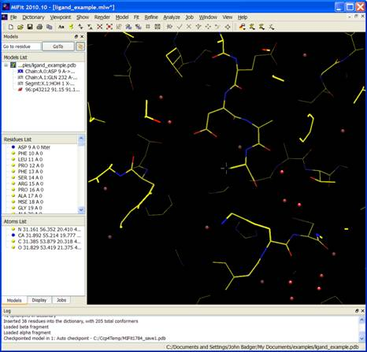
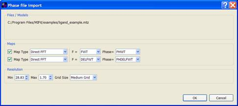
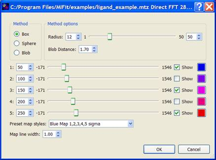

# Coordinate and map files

This chapter describes the process of loading coordinate and diffraction or density map data into MIFit.

**2.1 Loading coordinate data**

Atomic coordinate data may be loaded into MIFit using the **File/Open models, data, maps, etc**command. This command opens a browser window from which you may select the coordinate file that you wish to load. Coordinate data may be loaded in PDB format _(_.pdb_) or MIFit session file (.mlw_) format. Once selected, the coordinate data is immediately loaded and displayed.

**2.2 Navigating coordinate data from the tree view**

Figure 2.1 MIFit after loading a model

When set to the Models tab, three panes on the left of the MIFit interface (**Models List**, **Residues List**, **Atoms List**) are the tree control for managing and navigating around models. There may be one or more leaves for individual models in the top pane. Each structure model is subdivided into chains and segments in the **Residues List** and each residue is divided into atoms in the **Atoms List**.

A double mouse click on a residue in the tree control will center the view in the main canvas on that residue. A double mouse click on an atom in the tree control will center the view in the main canvas on that atom.

Alternatively, the **Go to residue**text box may be used to enter a chain id and residue number pair so as to center the canvas view on the selected residue. If a chain id is omitted the structure will center on the first residue number in the structure that matches the content of the text box. The icon next to the **GoTo**button is normally toggled on to synchronize the canvas view with selection.

**2.3 Navigating coordinate data from the main canvas**

When the mouse pointer rests over an atom in the main canvas, information about this atom is displayed in the status bar at the very bottom of the MIFit interface. For example, the text CYS 123 CA (12.345 23.456 34.567) Occ=1.00 B=12.3 is displayed for the CA atom from amino acid 123 cysteine at position 12.345 23.456 34.567, with unit occupancy and a temperature factor of 12.32.

When an atom in the canvas is clicked with the left mouse button this atom is put on a stack. A label of the form GLU 123 A CB is shown to the right of the atom and the message area in the lower left corner of the canvas pane will displays 1: GLU 123 CB. The stack may contain many atoms but the message area explicitly lists up to four of them with an additional line providing the number of any additional atoms, for example as, + 12 more. The top of the atom stack may be cleared with the menu item sequence **Show/Stack/Clear top item**and the entire stack may be cleared with menu item sequence **Show/Stack/Clear stack**. Atomic labels and information in the message area may be erased with commands **Show/Labels/Clear Labels**or **Show/Canvas/Clear Message**respectively.

**2.4 Loading electron density data**

Once a coordinate data set is loaded MIFit may be used as a molecular structure viewer. However, for crystallographic model fitting we also need to load and display an electron density map. Data for the calculation of electron density maps may be loaded into the document using the **File/Open models, data, maps, etc**command.

After loading a diffraction data files MIFit will calculate electron density maps via Fast Fourier Transforms. This mode of operation is often preferred to reading pre-computed maps because diffraction data files require much less disk space than map files. Furthermore, calculating electron density maps within MIFit is a more flexible approach because the user may easily change the map resolution or alter the grid spacing of the map display.

The currently supported diffraction data formats are the XtalView format (_.phs_), the SHELX format (_.fcf_), the CCP4 MTZ format (_.mtz_), and the mmCIF format (_.cif_). It should be noted that many different types of data are stored in mmCIF files  obviously, the data for this particular application should be structure factors.

The diffraction data format that is most commonly used and the main input data format for automated structure solution and refinement processes is the MTZ format. When data is loaded in this format the cell and space group information encoded in the file header are automatically assigned. A dialog window appears that allows the selection of density map types and the assignment of MTZ data labels to established data types (Fo, Fc, etc).

The pull down menu for the **Map Type**parameter allows the user to select for the calculation of various standard types of electron density maps. The available map types include various types of difference and SigmaA weighted maps. MIFit attempts to infer the correct labels for different categories of MTZ file data but the pull down menus to the right of each data field may be used to reassign data types to other MTZ column labels.

The resolution defaults (**Max Resolution**and **Min Resolution**parameters) are taken from the data limits of the data.

Setting the **Grid size**parameter to Medium grid is appropriate for most model fitting work; a finer grid gives a smoother appearance and may give better images for presentation graphics, particularly with low resolution data.

After clicking on **OK**, the specified map is calculated and displayed in the canvas window.

When reading map data directly, MIFit requires that the map is in ether the CCP4 or XtalView (FSFOUR) binary map format. There are a few situations where using pre-calculated maps is more appropriate than importing diffraction data. For example, a map may have been modified in real space by operations that are not easily reflected in reciprocal space and have no corresponding equivalent within the framework of MIFit.

**2.5 Map calculation from REFMAC5 output files**

When a structure is being refined by CCP4/REFMAC5, it is convenient and usually best to use the pre-computed density map coefficients in the output MTZ file for subsequent map calculations. Electron density maps computed using these likelihood weighted coefficients show less bias and more detail than most other map types.

Figure 2.2 Map calculation dialog box after entry of a CCP4/REFMAC5 output file

By default, the CCP4/REFMAC5 program writes MTZ files containing pre-computed likelihood weighted Fourier coefficients FWT, PHWT and DELFWT, PHDELFWT for the calculation of normal and difference maps respectively. MIFit will identify this special case and populate the **Map Type**fields with the **Direct FFT**option in order to facilitate convenient calculation of both normal and difference maps from these Fourier coefficients.

Note: It is inadvisable to allow MIFit to use the Fcalc values from CCP4/REFMAC5 due to the potential need for additional rescaling on to the Fo values. It is safer to use either the pre-computed map coefficients as described above or re-compute the Fcalc and Phase values from a model by selecting 'Model 1' for the Fc parameter. In the latter case it should also be noted that CCP4/REFMAC5 provides a more sophisticated treatment of solvent scattering and anisotropy than the internal scaling within the MIFit program.

**2.5 Controlling the map display**

Once loaded, the electron density map display may be modified by a right mouse click on the icon for the map file in the **Models List** tree and selection of the **Contour options**command.

Figure 2.3 Dialog box for changing the map display settings

In the resulting dialog box the **Method**and **Radius**parameters control the volume of electron density that is displayed. The **Method**parameter may be used to select whether the map will be displayed as a **Box** or **Sphere** around a selected point. Depending on the number of contour lines displayed, the fitting operation that is to be performed and the speed of the computer, it is usual to set a map display radius in the range 10-15.

The **Blob Method**is used to display electron density only within the **Blob Distance**of selected residues. The selection of target residues is by the same methods that are used for model fitting (for example, selection options under the **Fit**pull down menu) and the blob parameters are inactive unless such a selection has been made. The blob option is used for creating presentation graphics but should be applied with caution; there is a fine distinction between omitting density for clarity and eliminating surrounding map noise so as to mislead an audience into thinking that the map quality is better than it really is.

The **Preset Map Styles**pull down menu allows selection of a map display style from a set of standard contour level, colors and map types. Maps calculated within MIFit are scaled so that one sigma (the root-mean-square density fluctuation in the map) equals 50 internal map units. Therefore the default contour levels for a normal map (50, 100, 150 ...) correspond to density levels at 1, 2, 3, 4 ,5 sigma.

The **Show**checkboxes may be used to eliminate some of the contour levels from the display. It will often be the case that a map appears cluttered by too many contour surfaces and some of them can be switched off with these options. Often it is useful to display every other contour level (_i.e._ retaining the 50, 150, 250 levels).

The **Color**options may be used to change the color of an individual contour surface from the default colors associated with the **Preset map styles** selection.

The **Map line width**parameter may be used to change the line width used in the map display. For interactive fitting a line width of 1 is usually the most appropriate but it may be useful to display thicker lines when exporting images for journal graphics or when using projection to provide an interactive presentation.

**2.6 Moving around an electron density map**

MIFit automatically re-computes the display of the electron density map when the display is re-centered on a new atom or is translated by more than a few angstroms. Full crystal symmetry information is imposed on the map so there are no issues with moving outside a pre-computed map volume. Occasionally, the **Viewpoint/Center Visible Density**command may be useful to re-center the displayed density to lie in the center of the main canvas.

In order to locate significant density features that are not accounted for by the current model, a right mouse click on the relevant difference map icon in the **Models** **List** tree provides the **Find Ligand Density**option. This tool is parameterized to search electron density difference maps for relatively large density blobs (_i.e._ not features that could normally be accounted for by ordered water molecules). Putative ligand densities found by this tool are parameterized by a closely packed set of pseudo-atoms and may be picked as CLUST objects from the MIFit document tree. The larger clusters in this list correspond to the most extensive density features. If no CLUST objects appear in the document tree after executing this command then no density blobs were sufficiently extended to qualify as ligand densities.
