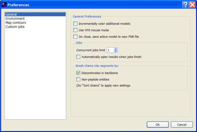
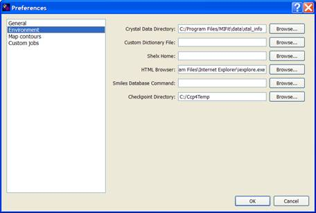
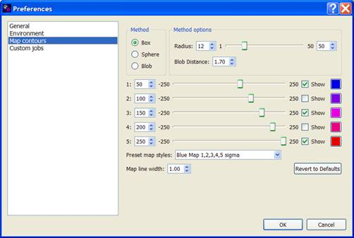
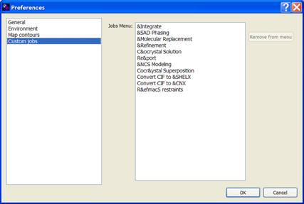

## Launching MIFit

Figure 1.1 The MIFit interface

On computers running the Linux operating system, MIFit may be started from the command line by simply executing the MIFit program that is found in the top level of the MIFit installation directory. It is not necessary to set any environment variables to run MIFit. However, if you intend to run CCP4 applications from the MIExpert interfaces in MIFit, the environment settings for CCP4 should be established prior to launch.

On computers running the Windows operating system, MIFit may be launched either by double mouse click on the MIFit desktop icon or by selecting **All Programs/MIFit/MIFit**from the Start menu. If CCP4 was properly installed, the CCP4 environment is automatically registered and available to MIFit.

The MIFit startup window (Figure 1.1) shows the most minimal menu and toolbars and a pane containing **Model**, **Display** and **Jobs** tabs on the left side. When a model is loaded, the **Model** tab contains a tree representation of the structure, allowing flexible editing, user selection of settings and navigation through the structure components.

With the Windows operating system, individual document windows may be cascaded, tiled vertically or tiled horizontally. With the Linux operating system, each document window always covers the whole document area and has a tab attached at the top. Clicking on the tab of a document brings its window to the top. The Windows version of MIFit contains an additional **Window**menu which controls the arrangement of document windows. The use of multiple documents windows allows, for example, a comparison of different models and maps which it may not be appropriate to load into a single document.

On the Linux operating system, MIFit stores user and environment specific parameters in a file called _.MIFit_ in the users home directory. If this file does not exist it is created the first time that MIFit is run. Once established, the _.MIFit_ file is read whenever MIFit is started. This file is not intended to be edited by users and all stored values can be changed through the use of MIFit.

## User preferences in MIFit

The **File/Preferences**menu is used to set information that will be used in every MIFit session.

The preference controls are separated into menus for **General**, **Environment**, **Map contours**and**Custom Jobs**.

### General preferences

Figure 1.2 The general preferences menu

Checking the **Incrementally color additional models**option sets an automatic color coding scheme that is applied when multiple models are loaded, _i.e._ each additional model is distinguished by coloring with a different default color.

The **Use XFit mouse mode**option may be used to set XFit-like functions to a 3-button mouse and otherwise has no effect.

By default, MIFit writes a session file containing current coordinates and display information on the current session when the session is closed. This allows the user to restart work from exactly the same state from which it was left. Some users may also wish to be prompted to write the current model to a PDB file and the **On close, save active model to new PDB file**option enables that preference.

MIFit provides access to the MIExpert interfaces for external crystallographic processes. However, on a single processor computer a MIFit session and a single background job (perhaps a refinement) will usually consume most of the computer memory and slow down interactive graphics. To avoid problems that will occur if multiple background jobs are inadvertently launched, the **Concurrent jobs limit**parameter may be used set to limit the number of simultaneous background jobs that is allowable.

The MIFit navigation tree displays the structure broken into chain identifiers. This tree may be configured via two checkboxes to further segment the individual chains upon meeting sequence number discontinuities (**Discontinuities in backbone**) and/or when meeting entities outside the normal set of amino acids (**Non-peptide entities**). For most purposes it is useful to segment according to discontinuities in the backbone sequence numbering.

Clicking on **OK**saves the user parameters displayed within this interface.

### Environment preferences

Figure 1.3 The environment preferences menu

Settings related to external software and paths are contained in the **Environment**preferences menu.

The **Crystal Data Directory**contains a set of files that may be used to define the crystal cell and space group information for structure determination projects. However, in the current version of MIFit and with the most popular data formats, the crystal information will usually be read directly from the input coordinate or data files and it will rarely be necessary for a user to setup independent crystal information. (The **File/Manage Crystals**command may be used to establish new crystal data files, if needed).

The **Custom Dictionary File**defines stereochemical information for the standard amino acids, cofactors and any ligands that you wish to add to the model. The default setting for this parameter is the dictionary file in the MIFit installation. To work with novel ligands, you may wish to create a custom dictionary file containing the appropriate stereochemical information with the Dictionary Editor. However, this information is only necessary for real space refinement and automated ligand placement; it is not needed for interactive manipulation of ligand coordinates in the MIFit canvas.

The **Shelx Home**parameter is available to assist running components of this software through MIFit interfaces. Currently, the use of SHELX is limited to a refinement option under **Job/Refinement** but in future it may also play a role in the development of a more complete SAD phasing system. The **Shelx Home**parameter defines the path to the directory that contains the programs from the SHELX system.

The **HTML Browser**parameter should contain the path to a web browser executable. Some of the **Jobs** applications may return information to the user on job completion by opening a browser window.

The **SMILES Database Command**is used to specify a command that will execute a user-provided script that, if provided with a ligand registration number on the command-line, will return a SMILES string to standard output. Typically the script would be written to perform a lookup in a corporate small molecule database. For example this parameter could be set to:

C:\Python26\python.exe "C:\my\_work\smilesdb.py"

to execute a Python script called _smilesdb._py stored in the folder _C:\my\_work_. The purpose of this command is to allow the Dictionary Editor direct access to SMILES data for the construction of 3D ligand molecules and the subsequent definition of refinement restraints.

MIFit maintains a series of checkpoint coordinate files so that the user may recover work in the case of software failure. These files are automatically deleted on a normal exit. It may be convenient to keep these files in a separate defined directory (rather than wherever the current working directory happens to be) and this file space may be defined with the **Checkpoint Directory**parameter.

Clicking on **OK**saves the user parameters displayed within this interface.

### Map contours preferences

Figure 1.4 The map contours preferences menu

This dialog box allows the user set personal preferences for the **Preset map styles**. The **Revert to Defaults** allows button allows reversion to standard MIFit defaults for a particular preset.

The **Method**and **Radius**parameters control the volume of electron density that is displayed. The **Method**parameter determines whether the map will be displayed as a **Box** or **Sphere** around a selected point. Depending on the number of contour lines displayed, the fitting operation that is to be performed and the speed of the computer, it is usual to set a map display **Radius** in the range 10-15. The **Blob Method**is used to display electron density only within the **Blob Distance**of selected residues and would not normally be used as a preference default.

The **Preset map styles**pull down menu allows selection of a map display style from a set of standard contour levels and colors which may be appropriate for different map types. Maps displayed by MIFit are scaled so that one sigma (the root-mean-square density fluctuation in the map) equals 50 internal map units. Therefore, the default contour levels for a normal map (50, 100, 150 ...) correspond to density levels at 1, 2, 3, 4, 5 sigma.

The **Show**checkboxes may be used to eliminate some of the contour levels from the display. It will often be the case that a map appears cluttered by too many contour surfaces and some of them can be deselected. Often it is convenient to display every other contour level _i.e._ levels 50, 150, 250.

The **Color**options may be used to change the color of the individual contour surfaces from the default colors specified by the **Preset map styles**choices.

The **Map line width**parameter may be used to change the line width used in the map display. For interactive fitting a line width of 1 is usually the most appropriate but it may be useful to display thicker lines when exporting images for journal graphics or when using projection during an interactive presentation.

Clicking on **OK**saves the user parameters displayed within this interface.

### Custom jobs preferences

Figure 1.5 The custom jobs preferences menu

This interface contains a list of items from the **Jobs** menu after the MIExpert package is installed. It may be used to remove specific menus from the list of available choices.

## Opening model, diffraction data and map files

Files may be loaded in to MIFit using the **File/Open models, data, maps, etc**command (keyboard shortcut **Ctrl+O**). This command may be used to load atomic model data from session (_.mlw_) or coordinate (_.pdb_) files. Files associated with atomic models that have been the subject of recent work are kept in a history list displayed in the lower part **File**menu. A double mouse click on file names in this list provides convenient access to these models.

A group of files may be selected and opened in one step by holding down Ctrl or Shift while selecting the files. When a group of coordinate files are loaded together they will be automatically color-coded if the **File/Preferences**setting **Incrementally color additional models**is checked. An additional setting **Render/Dim Non-active Models**may be deselected in order to view all models with equal visibility.

Diffraction data files and pre-computed electron density maps in the CCP4 or XtalView formats are may also be loaded using the **File/Open models, data, maps, etc**command. These types of data may be loaded simultaneously with coordinate files. For example, you may wish to load both a new model and map data coefficients resulting from a refinement run. Diffraction data and maps are discussed in Chapter 2.

## Creating a new document

Normally a user will simply wish to load pre-existing model or map data into MIFit. However, a new, empty document may be created with the **File/New**command (keyboard short-cut **Ctrl+N**). The **File/Open models, data, maps, etc**may then be used to add content to this document. To open files in to a different document, use the **File/Open into new document**command.

Opening documents changes the appearance of both the menu bar and the toolbar to provide access to commands for displaying and manipulating structure data. Opening an existing document or importing structure data into a document will immediately fill the model, canvas and navigator windows with document-related content.

## Introduction to session files

MIFit may be launched with or without command line parameters. The command line parameter most commonly supplied is the name of a MIFit session file, indicated by file extension _.mlw_. Session files contain information about individual projects and may be saved from the MIFit interface. A session file may be given to another person in your organization to review structure results. When a user opens the session file the exact view of the structure that was saved will be displayed, including any annotations that were provided. Since session files support access to diffraction data it is also possible to use them to provide non-crystallographers convenient access to density map information.

## Crystal information

The crystal data (cell dimensions and space group information) for an atomic model is automatically read from the input coordinate file, _i.e._ the information is taken from the CRYST1 record in the PDB format input file. This information is displayed in the navigation tree next to a small crystal icon beneath the amino acid chain segment information for the model.

It is highly recommended that PDB files containing correct CRYST1 records are used as input to MIFit. Dummy values (space group P1 and cell dimensions 100.0, 100.0, 100.0, 90.0, 90.0, 90.0) are applied if the input coordinate file lacks this information. The model cell and space group parameters control the generation of symmetry related molecules in the crystal.

When a structure factor or electron density map file is loaded into MIFit the crystal cell and symmetry associated with that data is independently read. The CCP4 MTZ and map formats store this information within file headers and using these file types as standard working formats facilitates straightforward handling of crystallographic calculations with MIFit. The data symmetry controls the calculation of density maps.

If the crystal information is known but absent from the input files a special crystal file may be established using the **File/Manage Crystals**command. The **New**button under the **Crystals:**section of this interface may be used to establish a new crystal file. The **Copy**or **Delete**commands may be used in conjunction with the selectable crystal list to copy or delete crystal information from the selected file. Information for a new crystal is entered through the **Title**, **Unit cell**fields together with a **Spacegroup**name or number. (Note that it is not necessary to enter the specific symmetry operations  these are determined using the **Find**button based on the **Spacegroup**parameter). Clicking on the **Apply**button adds this new crystal to the set of known crystals stored in the directory defined by the **File/Preferences/Environment/Crystal Data Directory**parameter.

Alternatively, when it is only necessary to select crystal data from a pre-existing crystal file, a right mouse button click on the crystal icon in the navigation tree provides an **Edit**command. With the **Select a crystal**radio button on, it is possible to select a crystal file from the scrollable list. Using the **Specify parameters**radio button allows the user to edit the selected crystal. The **OK**button sets and saves the current parameters.

## Default atom colors

The **File/Define Atom Colors**command may be used to redefine atom colors according to atom names. It will not normally be necessary to change these settings from the default values.

Atoms may also be colored according to the values provided in the B-factor column in the input coordinate file. The color definitions may be set using the **File/B-Value Colors Ranges**command, which provides a dialog window for setting the color values

## Stereochemical dictionaries

When MIFit is launched a dictionary file that contains stereochemical information on amino acids and other entities commonly found in protein crystal structures is loaded. This dictionary is used for model fitting and structure optimization within MIFit.

Unless a custom dictionary file was previously specified as a preference (using the **File/Preferences**menu for **environmental preferences)** the default dictionary is loaded from the file _MIFit/data/dict.noh.pdb_. When a new dictionary is loaded into MIFit the log window in the lower left will report statistical information on the dictionary contents.

The current dictionary may also be changed, perhaps just for a single modeling session, using the **Dictionary/Load New Dictionary**command. The dictionary may also be extended using the **Dictionary/Load Append Dictionary**command. Executing either of these items will pop up a file selection dialog window for specifying the additional dictionary files. Files with extensions _.pdb_or _.ent_(PDB format) or _.cif_(mmCIF format) may be read by MIFit for this purpose.

The task of adding a new ligand to a dictionary, including the ability to check and edit the refinement restraints is handled through Dictionary Editor with the **Dictionary/Import Ligand**command.

## Saving MIFit session files

A MFit session file **(_.mlw_), corresponding to the current state of the model and display with default name may be saved using the**File/Save Session**command. A session file with a new name may be saved by using the**File/Save Session As **command. Note that MIFit contains a safety feature so that if an attempt is made to close a document that was modified but not saved a warning prompt appears. This feature avoids losing the results of a model-building session by forgetting to save the work to a file.**

A separate command (**File/Export PDB...**) is used if, rather than a session file, you wish to save the current active model coordinates to the PDB file format.

## Closing a file and closing MIFit

A selected structure document may be closed using the **File/Close**command. Note that MIFit saves structure information in session files so that even if you began your MIFit session by importing a coordinate file in PDB format, this information will also be saved as a session file.

The MIFit program may be closed using the **File/Exit**command or by using the keyboard shortcut **Alt+X**.
